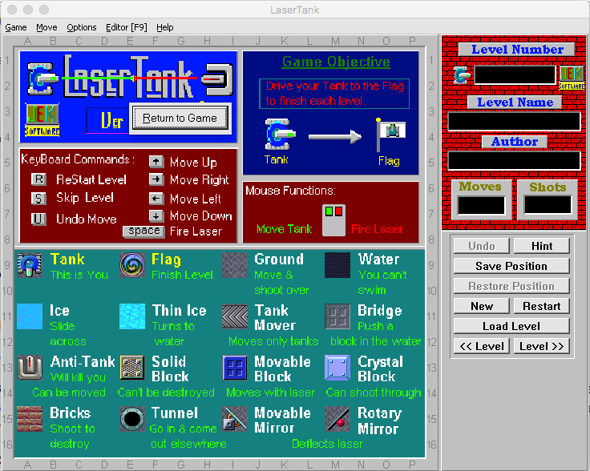
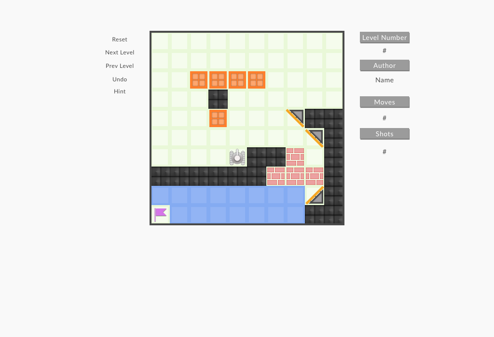

# LaserTank

### Background ###

LaserTank is a computer puzzle game requiring logical thinking to solve a variety of levels. The player must be able to concentrate and think ahead as in playing chess or checkers.

LaserTank is played on a 16 x 16 grid. The player must use the tank to reach a flag in every level without "dying". The player can move the tank in four directions and can fire a laser that is used to move or destroy objects. The amount of moves and shots it takes to complete a level are recorded in a high score list.

[LaserTank official website][lasertank-website]
[lasertank-website]: http://perso.cgocable.ca/lasertank/ltank_en.html

I used to be active involved into LaserTank community and created levels for all difficulties and I achieved a lot of global high scores.

### Functionality & MVP

Considered that we only have 20-30h for this project I will focus on creating smaller version of LaserTank with only several objects available on levels. And for bonus part and future development I could focus on adding new objects from original version of the game.

Users would be able to:

- [ ] Easily understand How To Play this game
- [ ] Start new Game, Reset Level
- [ ] Move Tank on the Board, Shoot with Laser to move Blocks
- [ ] Play multiple levels, Select Level
- [ ] Undo moves

### Wireframes ###

This app will consist of a single screen with game board, game controls and info, and nav linkgs to the github, my LinkedIn.
Game Controles will include: Reset, Next, Prev, Undo, Hint, How To Play (initial state of the board)

### Architecture and Technologies ###

This project will be implemented with the following technologies:
- React.js and Redux for overall structure and logic for rendering board, game objects and UI
- HTML5 Canvas for rendering board and game objects
- Vanilla JavaScript for main game logic

Store will contain application state that will reflect current situation on the board that need to be displayed (rendered).

User actions `move` or `shoot` will be as a redux actions -> that will affect application state depends on game logic.

#### Game Logic ####
For MVP I focus to implement only this objects and logic:
- `Tank` can moves over `Ground` or `Bridge`
- `Tank` dies when move over `Water`
- `Tank` won the game if moves over `Flag`
- `Tank` can shoot `Laser`
- `Tank` dies if collides with `Laser`
- `Laser` move _movable objects_ on 1 cell if possible, when collides with them
- `Laser` disappears when collides with _solid objects_
- `Laser` change direction when collides with Mirror side of `Movable Mirror`
- `Laser` destroy `Bricks` object, when collides
- `Movable Block` becomes `Bridge` when collides with `Water`

### Implementation Timeline ###

__Day 1__: Setup all Node modules, Webpack, React. Create skeleton in React and Redux for rendering board and objects from state.

Goals for the day:
- Board and Objects renders in Html5 Canvas properly
- Board and Objects re-renders on change properly

__Day 2__: Start creating game logic and objects with logic. Implement Tank object, Laser object, Solid Block and Movable Block.

Goals for the day:
- `Tank` can moves over `Ground`
- `Tank` can shoot `Laser`
- `Laser` push `Movable Block`
- `Laser` disappears when collides with _solid objects_

__Day 3__: Working on Movable Block, Water and Bridge logic. Add Flag to the game. Add multiple levels.

Goals for the day:
- `Tank` dies when move over `Water`
- `Tank` won the game if moves over `Flag`
- `Movable Block` becomes `Bridge` when collides with `Water`
- Next level loads when User win

__Day 4__: Polyshing game logic and Adding UI. Working on Bonus objects: `Mirror` and `Bricks`.

Goals for the day:
- Game is fully playable with `Tank`, `Laser`, `Flag`, `Movable Block`, `Solid Block`, `Water`, `Bridge`
- Working on User Interface for Navigating between levels and Reseting the game
- Add at least 10 levels to the game
- Implement Undo button (save state before each user action)

### Bonus features ###

Original game has much more objects, and at some point I would like to implement all of them:
`Movable Mirror` and `Rotary Mirror` - Deflects `Laser`
`Crystal Block` - Can shoot through
`Anti-Tank` - Will kill Tank if on his way. Can be moved. Can be destroyed.
`Tank Mover` - Moves only Tank
`Ice` - Slide across
`Thin Ice` - Turns to water
`Bricks` - Shoot to destroy
`Tunnel` - Can be 8 types of tunnels. Any numbers of each type.
