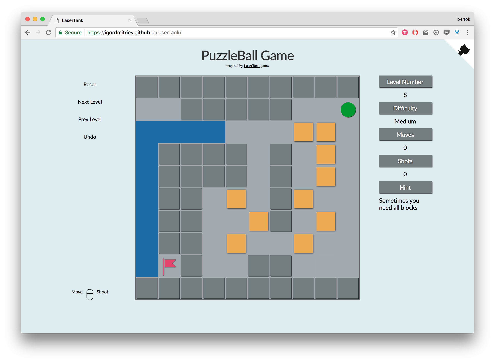

# PuzzleBall

[Play Game][live-link]
[live-link]:https://igordmitriev.github.io/lasertank/

PuzzleBall is a computer puzzle game requiring logical thinking to solve a variety of levels. The player must be able to concentrate and think ahead as in playing chess or checkers.



It's inspired by original puzzle game LaserTank.
[LaserTank official website][lasertank-website]
[lasertank-website]: http://perso.cgocable.ca/lasertank/ltank_en.html


### Functionality

The game has multiple levels. It starts with intro levels explaining how this game works and what user need to do to pass the level. It became more complicated and engaging.

Users can be able to control ball with Mouse: left-click to move to the square, right-click to shoot to direction.

Users can traverse between levels, reset level if get stacked and, also, be able to Undo moves if made a mistake.

### Implementation

This project will be implemented with the following technologies:
- React.js and Redux for overall structure and logic for rendering board, game objects and UI
- HTML5 Canvas for rendering board and game objects
- Vanilla JavaScript for main game logic

The combination between ReactJS and Canvas give us an ability to redraw only parts of the canvas that need to be updated. It make the game lag-free and needs very low resources. So user can keep game open and don't think about battery consumption.

The general React structure looks like this:

```
<PuzzleBall>
  <Game>
    { this.generateTiles() }
  </Game>
</PuzzleBall>
```
`PuzzleBall` component read current board from `store` and generate `Game` component and `Tile` components for each element of the board.

`Game` component is a wrapped for canvas. And it generates `Tiles` by giving them canvas.

```
mapChildren () {
  return React.Children.map(this.props.children, child => (
    React.cloneElement(child, {
      ctx: this.state.ctx
    })
  ));
}

render(){
  return (
    <canvas id="board" width="1200px" height="1200px">
      { this.state.ctx ? this.mapChildren() : [] }
    </canvas>
  );
}
```

And finally `Tile` component is responsible for each element of the board and how to `draw` or `clear` the corresponded part on the canvas.

I initialize them by passing all necessary information:
```
<Tile
  key={ `${colIdx}-${rowIdx}` }
  object={ el }
  x={ colIdx * 120 }
  y={ rowIdx * 120 }
  w={ 120 }
  h={ 120 }
  laserOver={ laserOver } />
```

And it decide how to draw it depends on `props.object`, i.e.:
```
case 'F':
  Sprites.drawGround(ctx, x, y, w, h);
  Sprites.drawFlag(ctx, x, y, w, h);
```

And more importantly we check if this square of the canvas need to be re-rendered:
```
shouldComponentUpdate (nextProps, nextState) {
  return (this.props.object !== nextProps.object ||
          this.props.x !== nextProps.x ||
          this.props.y !== nextProps.y ||
          this.props.laserOver !== nextProps.laserOver);
}
```

All `Sprites` are a canvas drawing elements:

```
export const drawFlag = (ctx, x, y, w, h) => {
  let color = '#E5446D';
  ctx.shadowOffsetX = 2;
  ctx.shadowOffsetY = 2;
  ctx.shadowBlur = 5;
  ctx.shadowColor = "rgba(0, 0, 0, .75)";
  ctx.fillStyle = color;
  ctx.fillRect(x + 25, y + 20, 5, 90);
  ctx.beginPath();
  ctx.moveTo(x + 35, y + 25);
  ctx.lineTo(x + 95, y + 25);
  ctx.lineTo(x + 75, y + 45);
  ctx.lineTo(x + 95, y + 65);
  ctx.lineTo(x + 35, y + 65);
  ctx.fill();

  clearShadows(ctx);
};
```

So this pattern give me an ability to easily render and re-render my current board from the state.

The board updates by `gameReducer`:
```
switch (action.type) {
  case UNDO: ---
  case SET_LEVEL: ---
  case RESET_LEVEL: ---
  case MOVE_TANK: ---
  case MOVE_LASER: ---
  case MOVE_LASER_FORWARD: ---
}
```

To implement `Undo`. which is very useful. Because it very easy for Users to occasionally make a mistake, I keep track of all board states in `past` array.
```
board: {
  past: [[previousBoard_N], [previousBoard_N-1] ... [previousBoard]],
  present: [currentBoard]
},
```

And time travel back if user click `Undo` button.


### Mouse Control

__Move__: I added left-click listener to canvas and calculate on what cell user clicked, convert current board to movable/unmovable matrix.
For time-save reason I decided to use `PathFinding.js` A* algorithm to find a valid path and then I translate it to valid moves:
```
const moves = findPath(board, x, y);

<...>

let tankX = moves[0][0];
let tankY = moves[0][1];
let dx, dy;
moves.slice(1).forEach( (pos, idx) => {
  setTimeout( () => {
    this.moving = true;
    dx = pos[0] - tankX;
    dy = pos[1] - tankY;
    [tankX, tankY] = pos;
    this.props.moveTank(dx, dy);
  }, 100 * idx);
});
```

__Shoot__: User can shoot by right-click on any part of canvas, and it will be calculate and adjusted to nearest available direction.

```
if (Math.abs(dx) < Math.abs(dy)) {
  if (dy > 0) {
    this.props.shootUp(board, tankX, tankY);
  } else {
    this.props.shootDown(board, tankX, tankY);
  }
} else {
  if (dx < 0) {
    this.props.shootRight(board, tankX, tankY);
  } else {
    this.props.shootLeft(board, tankX, tankY);
  }
}
});
```
